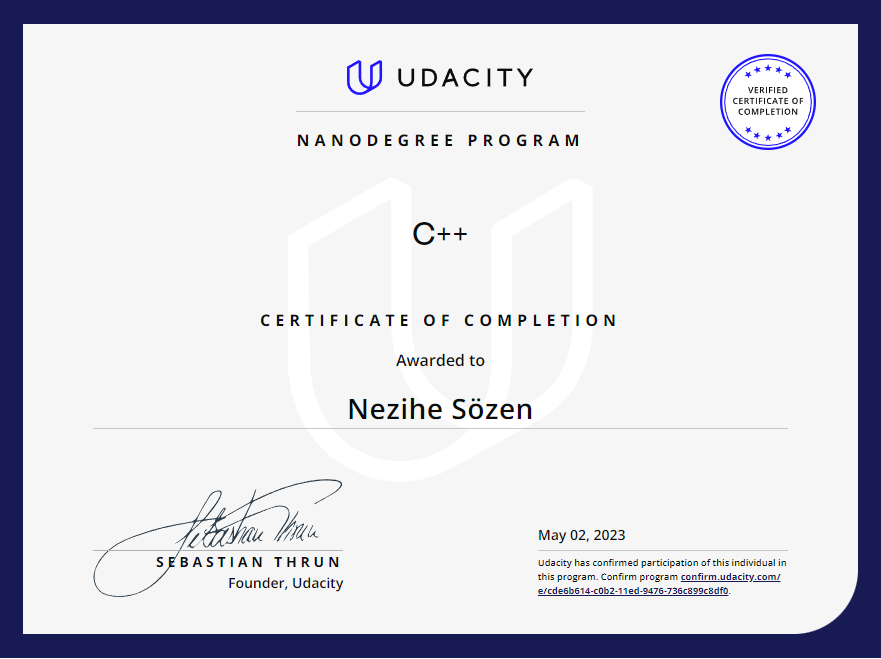

# Udacity C++ Nanodegree Program
Udacity C++ Nanodegree Program

### [Project 1 - Build an Route Planning App](https://github.com/NeziheSozen/Udacity-CPP-Nanodegree-Build-an-OpenStreetMap-Route-Planner)

The OpenStreetMap Route Planning Application is the first project in the Udacity C++ Nanodegree program. This project focuses on building a C++ application that uses OpenStreetMap data to find the shortest path between two points on a map.

The project involves several key steps, including reading and parsing OpenStreetMap data, implementing an A* search algorithm for route planning, and visualizing the results using the IO2D library. 

### [Project 2 - Build a System Monitor](https://github.com/NeziheSozen/Udacity-CPP-Nanodegree-Build-a-System-Monitor)

The second project of the Udacity C++ Nanodegree involves building a system monitor application. The system monitor is a C++ program that provides real-time monitoring of various system metrics, such as CPU usage, memory usage, and process information. The application utilizes Linux system calls and object-oriented programming concepts to gather and display system data in a user-friendly interface. The summary of the project entails designing and implementing a system monitor that captures and displays critical system statistics, giving users insight into their system's performance.

### [Project 3 - Build a Memory Management Chatbot](https://github.com/NeziheSozen/Udacity-CPP-Nanodegree-Build-a-Memory-Management-Chatbot)

The third project of the Udacity C++ Nanodegree involves building a memory management chatbot application. The chatbot is designed to manage a user's personal notes, including creating, storing, retrieving, and deleting notes. The application uses C++ concepts such as classes, objects, and dynamic memory allocation to implement the chatbot's functionality. The project focuses on utilizing smart pointers and memory management techniques to prevent memory leaks and ensure efficient memory usage. The content summary highlights how the project involves building a chatbot application that manages personal notes using C++ memory management concepts, making it a valuable learning experience for mastering memory management in C++.

### [Project 4 - Build a Concurrent Traffic Simulation](https://github.com/NeziheSozen/Udacity-CPP-Nanodegree-Build-a-Concurrent-Traffic-Simulation)

The fourth project in the Udacity C++ Nanodegree program involves building a concurrent traffic simulation application. The project focuses on implementing multithreading techniques in C++ to create a traffic simulation with multiple vehicles and traffic lights that operate concurrently. The summary of the project includes designing and implementing a traffic simulation system using object-oriented programming principles, utilizing concurrent programming techniques such as mutexes and condition variables to manage shared resources, and creating a graphical user interface to visualize the simulation. The project provides hands-on experience in developing concurrent applications in C++ and reinforces concepts related to multithreading, synchronization, and object-oriented programming.

